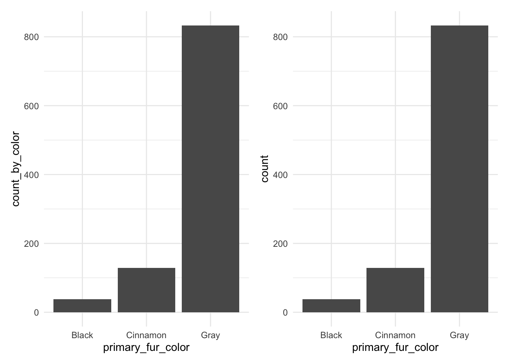

Making Bar Plots
================
w203: Statistics for Data Science

``` r
library(tidyverse)
library(ggplot2)
# install.packages('patchwork')
library(patchwork)

theme_set(theme_minimal())
knitr::opts_chunk$set(dpi = 200)
```

``` r
squirrel_subset <- read.csv('squirrels_subset.csv')
```

``` r
squirrel_subset_by_color <- squirrel_subset %>%  
  group_by(primary_fur_color) %>%  
  summarise(count_by_color = n())
```

    ## `summarise()` ungrouping output (override with `.groups` argument)

# Task

Produce two identical plots that have the following characteristics:

  - On the x-axis the plots have the color of the squirrel fur
  - On the y-axis the plots have a count of the nubmer of squirrels that
    have that color fur

However, make these plots in two ways:

1.  In one plot, use `geom_bar()` (and the appropriate dataset)
2.  In the other plot, use `geom_col()` (and the appropriate dataset)

Note that the datsets will be different for each of the different
geometries.

``` r
plot_col <- squirrel_subset_by_color %>%  
  ggplot() + 
  aes(x = primary_fur_color, y = count_by_color) + 
  geom_col()

plot_bar <- squirrel_subset %>%  
  ggplot() + 
  aes(x = primary_fur_color) + 
  geom_bar()

plot_col | plot_bar
```

<!-- -->
