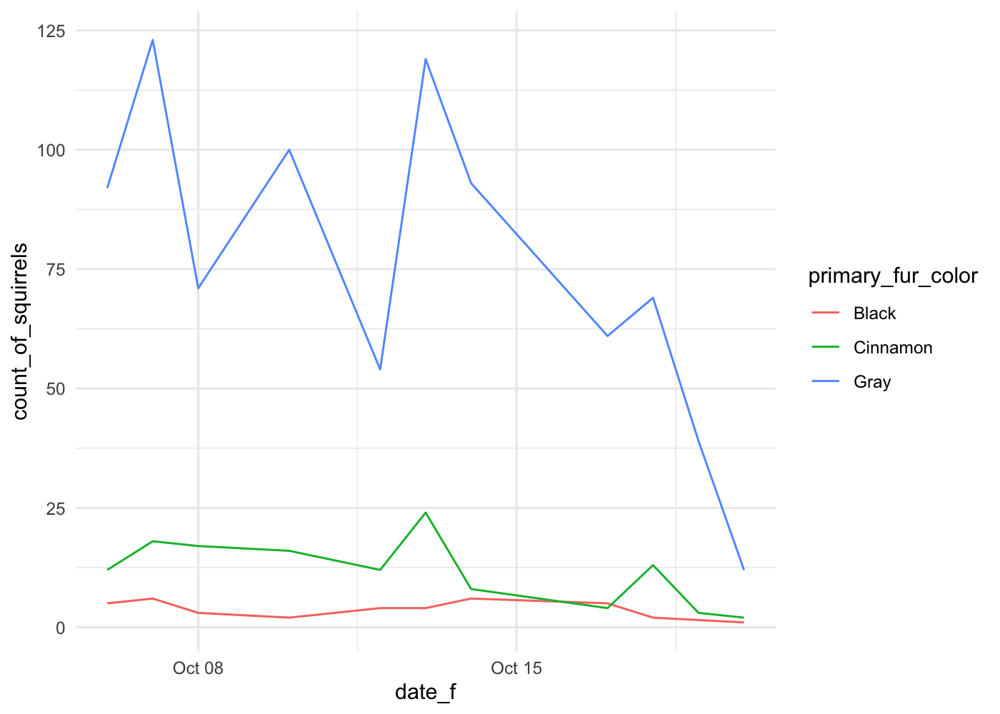

Line Plots Solutions
================
w203: Statistics for Data Science

``` r
library(tidyverse)
library(ggplot2)
theme_set(theme_minimal())
knitr::opts_chunk$set(dpi = 200)
```

``` r
squirrel_subset <- read_csv('./squirrels_subset.csv')
```

    ## Parsed with column specification:
    ## cols(
    ##   long = col_double(),
    ##   lat = col_double(),
    ##   hectare = col_character(),
    ##   date = col_double(),
    ##   age = col_character(),
    ##   primary_fur_color = col_character()
    ## )

``` r
squirrel_subset <- squirrel_subset %>%
  mutate(date_f = as.Date.character(date, format = '%m%d%Y'))
```

# Squirrels by date

  - Make a line plot that shows the squirrels observed by date

<!-- end list -->

``` r
squirrel_subset %>%
  group_by(date_f) %>%
  summarise(count_of_squirrels = n()) %>%
  ggplot() +
  aes(x = date_f, y = count_of_squirrels) +
  geom_line()
```

    ## `summarise()` ungrouping output (override with `.groups` argument)

<!-- -->

# Challenge: Squirrels by color by date

``` r
squirrel_subset %>%
  group_by(date_f, primary_fur_color) %>%
  summarise(count_of_squirrels = n()) %>%
  ggplot() +
  aes(x = date_f, y = count_of_squirrels, color = primary_fur_color) +
  geom_line()
```

    ## `summarise()` regrouping output by 'date_f' (override with `.groups` argument)

<!-- -->
